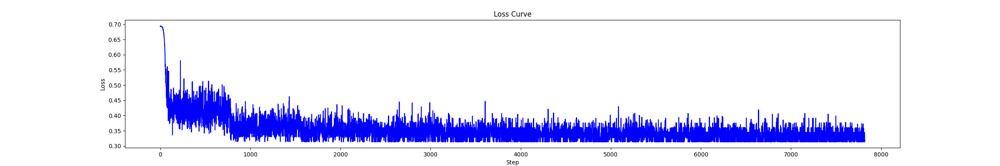

# 自然语言处理实践

[](https://github.com/JerryQ17) [](https://github.com/JerryQ17/NLP-Learning) 

## 目录

- [目录](#目录)
- [实验环境](#实验环境)
- [实验准备](#实验准备)
  - [创建虚拟环境](#创建虚拟环境)
  - [激活虚拟环境](#激活虚拟环境)
  - [安装项目依赖](#安装项目依赖)
  - [安装PyTorch](#安装pytorch)
  - [退出虚拟环境](#退出虚拟环境)
- [实验过程](#实验过程)
- [实验结果](#实验结果)


---

## 实验环境

- 硬件
  - CPU: i7-12700H
  - RAM: 16GB DDR5
  - GPU: RTX 3060 Laptop 6GB
- 软件
  - Windows 11 x64
  - Python 3.10
  - Cuda 12.2

---

## 实验准备

因为之前没有使用过`conda`，所以我选择使用`venv`管理`python packages`。

你应当按照如下所述的方法配置本项目。

### 创建虚拟环境

在项目根目录中打开`powershell`，输入以下代码：

```powershell
python -m venv venv
```

创建了一个名为`venv`的虚拟环境。你会发现根目录中多了一个名为`venv`的文件夹。

### 激活虚拟环境

接着在刚刚的`powershell`中输入以下代码：

```powershell
.\venv\Scripts\activate.bat
```

激活了刚刚创建的`venv`环境，你会发现`powershell`左侧多出了`(venv)`的提示。

### 安装项目依赖

接着在刚刚的`powershell`中输入以下代码：

```powershell
pip install -r requirements.txt
```

安装了项目的依赖包，除了`pytorch`。

### 安装PyTorch

> Notes: `Pytorch`的版本因人而异，我使用的版本不一定适合你，你应该前往[`Pytorch官网`](https://pytorch.org/)获取对应版本的`Pytorch`的安装链接。

> Notes: `Package`选项要选`Pip`，安装命令要在`venv`环境中安装。

接着在刚刚的`powershell`中输入以下代码：

```powershell
pip3 install --pre torch torchvision torchaudio --index-url https://download.pytorch.org/whl/nightly/cu121
```

安装了`pytorch preview for cuda 12.1`。

### 退出虚拟环境

这一步是可选的，如果你想立刻运行项目程序，则可以跳过这一步，如果你不想立刻运行项目程序，则可以直接退出虚拟环境。

接着在刚刚的`powershell`中输入以下代码：

```powershell
deactivate
```

这样就可以退出虚拟环境，并返回到本地环境中。

---

## 实验过程

### TF-IDF

#### SVM

一开始，看到SVM有十几个参数可以改变，头都大了。后来看到`libsvm`中有一个`grid.py`文件，它通过对`cost`和`gamma`进行排列组合筛选最优参数，但是要单独通过命令行的方式计算，不利于代码的整合。于是我在`Trainer`中添加了`grid`的功能，使用起来更加方便。

然而，在筛选过程中，我选择的网格搜索的范围[10^-8^, 10^8^]过大，导致计算时间过长（一个星期还没算完），计算期间因为一次意外情况导致程序意外终止，在我此前备份的计算结果中，`cost=1 gamma=1`准确率最高，所以我最终只能选择这个参数组合训练SVM。

模型保存于[`.\svm\model\svm_model0_c_1.0_g_1.0.model`](.\svm\model\svm_model0_c_1.0_g_1.0.model)(未上传GitHub)

#### LSTM

LSTM层的参数：

|    参数     |    值    |
| :---------: | :------: |
| input_size  | `101895` |
| hidden_size |  `256`   |
| num_layers  |   `1`    |

LSTM层之后的全连接层：

```python
nn.Sequential(
	nn.Linear(256, 128),
	nn.ReLU(),
	nn.Linear(128, 64),
	nn.ReLU(),
	nn.Linear(64, 2)	# 输出张量，第一个值表示positive的概率，第二个值表示negative的概率
)
```

最后还有一层`Sigmoid`层用来转换输出的概率。

一共训练了10个epoch，损失值的变化如图所示：



我认为模型已经收敛了，所以终止了训练。

模型保存于[`.\lstm\model\new_train_lstm.pth`](.\lstm\model\new_train_lstm.pth)(未上传GitHub)

### Word to Vec

没做

---

## 实验结果

### TF-IDF

评估的准确率是在整个训练集上的结果。

| 模型 | 训练集准确率 |
| :--: | :----------: |
| SVM  |  `98.778%`   |
| LSTM |  `98.142%`   |

> 为什么不使用测试集来评估呢？
>
> 如果将原始数据集分为训练集和测试集：
>
> 1. 如果使用原始数据集进行训练，测试集进行评估，那么和直接使用原始数据集评估没什么区别
> 2. 如果使用训练集进行训练，测试集进行评估，那么训练集的tf-idf向量长度与测试集的tf-idf向量长度不同，表示的意义也不同，无法进行评估

### Word to Vec

没做
