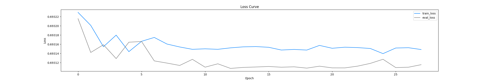
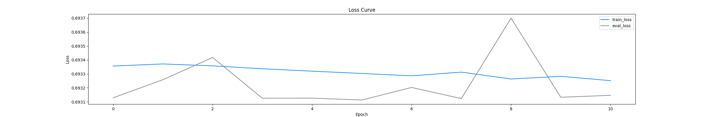
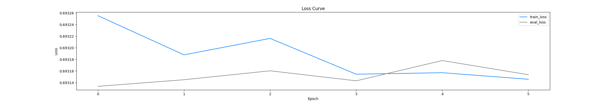
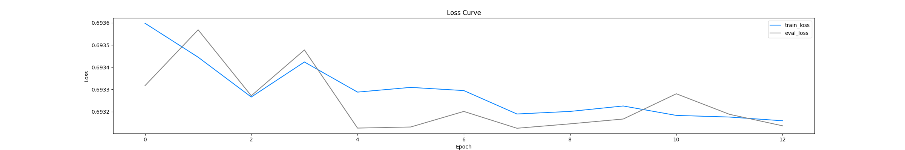
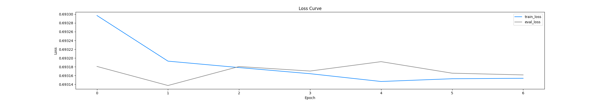
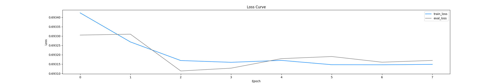
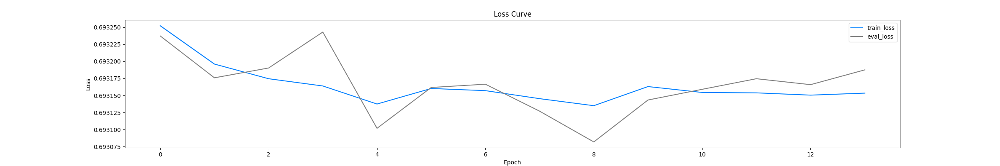
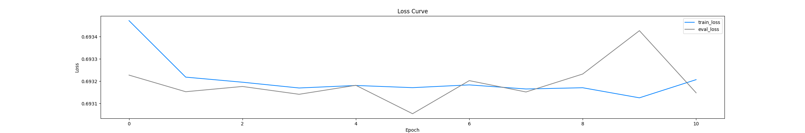
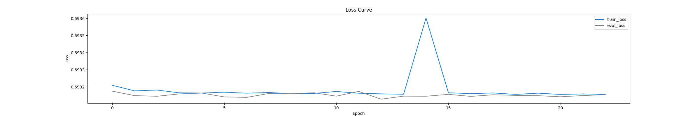

# 自然语言处理实践

[](https://github.com/JerryQ17) [](https://github.com/JerryQ17/NLP-Learning) 

## 目录

- [目录](#目录)
- [实验环境](#实验环境)
- [实验准备](#实验准备)
  - [创建虚拟环境](#创建虚拟环境)
  - [激活虚拟环境](#激活虚拟环境)
  - [安装项目依赖](#安装项目依赖)
  - [安装PyTorch](#安装pytorch)
  - [退出虚拟环境](#退出虚拟环境)
- [实验过程](#实验过程)
- [实验结果](#实验结果)


---

## 实验环境

- 硬件
  - CPU: i7-12700H
  - RAM: 16GB DDR5
  - GPU: RTX 3060 Laptop 6GB
- 软件
  - Windows 11 x64
  - Python 3.10
  - Cuda 12.2

---

## 实验准备

Python虚拟环境是一种用于在单个系统中隔离和管理不同Python项目的工具。每个环境都有自己的包安装和依赖关系。这样可以防止不同项目之间的包冲突，确保项目之间的隔离性。

### 创建虚拟环境

我们使用`conda`或`venv`来创建并管理Python虚拟环境。

推荐使用`conda`，因为本项目开发于Python3.10版本，`conda`允许创建虚拟环境时指定Python版本，而`venv`则依赖于系统Python。

也就是说，如果你使用`venv`，则必须确保系统Python版本为3.10。

#### conda

运行以下命令：

```powershell
conda create -n nlp python=3.10
```

创建了一个名为`nlp`的虚拟环境，并指定Python版本为`3.10`

#### venv

> **Warning**: 使用`venv`虚拟环境时，要求系统Python版本为**3.10**

在项目根目录中打开`powershell`，运行以下命令：

```powershell
python -m venv venv
```

创建了一个名为`venv`的虚拟环境

### 激活虚拟环境

#### conda

运行以下命令以激活刚刚创建的`nlp`环境：

```powershell
conda activate nlp
```

#### venv

运行以下命令以激活刚刚创建的`venv`环境：

```powershell
.\venv\Scripts\activate.bat
```

### 安装项目依赖

>  Notes: 本步骤`conda`和`venv`通用。

运行以下命令以安装除了`pytorch`以外的本项目的依赖包：

```powershell
pip install -r requirements.txt
```

### 安装PyTorch

`Pytorch`的版本因人而异，你应该前往[Pytorch官网](https://pytorch.org/)获取对应版本的`Pytorch`的安装链接。

#### conda

> Notes: `Package`选择`Conda`，安装命令要在`nlp`环境中安装。

运行以下命令以安装`pytorch preview for cuda 12.1`：

```powershell
conda install pytorch torchvision torchaudio pytorch-cuda=12.1 -c pytorch-nightly -c nvidia
```

#### venv

> Notes: `Package`选择`Pip`，安装命令要在`venv`环境中安装。

运行以下命令以安装`pytorch preview for cuda 12.1`：

```powershell
pip3 install --pre torch torchvision torchaudio --index-url https://download.pytorch.org/whl/nightly/cu121
```

### 退出虚拟环境

这一步是可选的，如果你想立刻运行项目程序，则可以跳过这一步，如果你不想立刻运行项目程序，则可以直接退出虚拟环境。

#### conda

运行以下命令以退出虚拟环境：

```powershell
conda deactivate
```

#### venv

运行以下命令以退出虚拟环境：

```powershell
deactivate
```

---

## 实验过程

> Notes: 此部分并不讨论与代码实现有关的内容，仅就模型超参数的选取以及训练过程展开描述。
>
> 如果读者对技术细节以及代码实现感兴趣，可以移步[文档](documents.md)或直接查看源代码。如有疑问，可在[Github](https://github.com/JerryQ17/NLP-Learning)提出Issue。

### TF-IDF

#### SVM

在浏览`libsvm`源码时，我注意到`libsvm`中的`grid.py`文件，它通过对`cost`和`gamma`进行排列组合筛选最优参数，但是要单独通过命令行的方式计算，不利于代码的整合。于是我在`Trainer`中添加了`grid`的功能，使用起来更加方便。

然而，在筛选过程中，我选择的网格搜索的范围[10^-8^, 10^8^]过大，导致计算时间过长（一个星期还没算完），计算期间因为一次意外情况导致程序意外终止，在我此前备份的计算结果中，`cost=1,gamma=1`组合的准确率最高，所以我最终只能选择这个参数组合训练SVM。

模型保存于[`.\svm\model\svm_model0_c_1.0_g_1.0.model`](.\svm\model\svm_model0_c_1.0_g_1.0.model)(未上传GitHub)

> PS: 此次意外也促使我实现了自动保存的功能，不过该功能未经测试，尚不清楚该功能是否有效。

#### LSTM

LSTM层的参数：

|     参数      |    值    |
| :-----------: | :------: |
| `input_size`  | `101895` |
| `hidden_size` |  `256`   |
| `num_layers`  |   `1`    |

LSTM层之后的全连接层：

```python
nn.Sequential(
	nn.Linear(256, 128),
	nn.ReLU(),
	nn.Linear(128, 64),
	nn.ReLU(),
	nn.Linear(64, 2)	# 输出张量，第一个值表示positive的概率，第二个值表示negative的概率
)
```

最后还有一层`Sigmoid`层用来转换输出的概率。

一共训练了10个epoch，损失值的变化如图所示：


因为后半部分的`loss`已经趋于稳定，我认为模型已经收敛了，所以我在第10个epoch结束时终止了训练。

模型保存于[`.\lstm\model\new_train_lstm.pth`](.\lstm\model\new_train_lstm.pth)(未上传GitHub)

### Word to Vec

由于时间原因，只做了LSTM部分的实验。

#### LSTM

##### 引入早停法

在这一部分的实验中，我了解到一个新的训练方法（早停法），它可以自动控制训练何时停止以达到最好的训练效果。在上一阶段的实验中，我训练前手动指定训练轮数，由于经验不足，这也许会导致模型欠拟合或过拟合。早停法将会解决这个问题。

我自行实现了一个简单的早停法训练函数`Trainer.early_stopping`。该方法判断模型在评估集上的损失，如果一定轮次内损失率没有降低，则终止训练。

我先使用一个模型测试了这个训练函数。该测试的参数如下：

- `early_stopping.patience = 15`

- `Word2Vec.vector_size = lstm.input_size = 100`

- `lstm.hidden_size = 144`

- `lstm.num_layer = 1`

- ```python
  fc_layer = nn.Sequential(
  	nn.Linear(144, 100),
  	nn.ReLU(),
  	nn.Linear(100, 64),
  	nn.ReLU(),
  	nn.Linear(64, 2)
  )
  ```

训练终止于第28轮。因为这次训练的目的是测试，所以没有测量评估集上的准确率。

训练集和评估集上的损失值曲线如图所示：

> Notes: 我改进了损失值曲线的计算方法，将一次训练的所有损失值取平均值，得到的图像更清晰明了，但可能损失某些细节。



根据图像，我认为模型训练阶段可以分为三个阶段：

- 第1-6轮：模型损失值快速下降，但存在振荡，处于欠拟合的阶段
- 第7-21轮：模型损失值缓慢下降，逐步收敛，训练效果良好
- 第22-28轮：训练集损失值突然下降，然后恢复，评估集损失值突然上升，然后恢复。这似乎暗示在第24轮结束时，模型出现了较明显的过拟合现象，之后模型似乎摆脱了过拟合的状态，原因不明。

由此可知，此次测试中模型经历了一次过拟合，原因可能是`patience`取值过大(`15`)，导致模型训练轮数过多。当`patience`取一个合理的小值时，模型将会在第二阶段时终止训练，这时的训练效果应当比较理想。

令我疑惑的是，虽然从曲线上看，损失值斜率变化程度比较大，但是从数值上看，损失值的变化仅在小数点第3位以后，变化相对较小，不清楚第二阶段时的模型是否真正收敛。由于算力有限，我未能继续训练模型寻找此问题的答案，我假定在第二阶段时模型已经收敛。

此次测试证明了我实现的早停法能够在参数合理时正确终止模型训练，为下一阶段的实验奠定了良好的基础。

---

## 实验结果

### TF-IDF

评估的准确率是在整个训练集上的结果。

| 模型 | 训练集准确率 |
| :--: | :----------: |
| SVM  |  `98.778%`   |
| LSTM |  `98.142%`   |

> 为什么不使用测试集来评估呢？
>
> 如果将原始数据集分为训练集和测试集：
>
> 1. 如果使用原始数据集进行训练，测试集进行评估，那么和直接使用原始数据集评估没什么区别
> 2. 如果使用训练集进行训练，测试集进行评估，那么训练集的tf-idf向量长度与测试集的tf-idf向量长度不同，表示的意义也不同，无法进行评估

### Word to Vec

我随机选取数据分别作为训练集、验证集、测试集，比例为7:1:2。具体数据见表：

| 数据集 | 正面数据 | 负面数据 |
| :----: | :------: | :------: |
| 训练集 |  17547   |  17543   |
| 验证集 |   2500   |   2500   |
| 测试集 |   4953   |   5047   |

#### 似乎不太成功的尝试

一开始，我先选取了6个超参数组合，训练均使用早停法，`patience=5`，测试结果如下：

```python
TextClassifier(input_size=100, hidden_size=100, num_layers=1, fc=nn.Linear(100, 2))
```



模型0于第11轮训练结束后终止训练，准确率`50.36%`，保存于[`.\lstm\model\w2v_model0.pth`](.\lstm\model\w2v_model0.pth)(未上传GitHub)。

```python
TextClassifier(
    input_size=100, hidden_size=100, num_layers=1,
    fc=nn.Sequential(
		nn.Linear(100, 50),
		nn.ReLU(),
		nn.Linear(50, 2)
))
```



模型1于第6轮训练结束后终止训练，准确率`49.64%`，保存于[`.\lstm\model\w2v_model1.pth`](.\lstm\model\w2v_model1.pth)(未上传GitHub)。

```python
TextClassifier(input_size=100, hidden_size=144, num_layers=1, fc=nn.Linear(144, 2))
```



模型2于第13轮训练结束后终止训练，准确率`50.36%`，保存于[`.\lstm\model\w2v_model2.pth`](.\lstm\model\w2v_model2.pth)(未上传GitHub)。

```python
TextClassifier(
    input_size=100, hidden_size=144, num_layers=1,
    fc=nn.Sequential(
		nn.Linear(144, 72),
		nn.ReLU(),
		nn.Linear(72, 2)
))
```



模型3训练结束轮次未保存😆，准确率`49.64%`，保存于[`.\lstm\model\w2v_model3.pth`](.\lstm\model\w2v_model3.pth)(未上传GitHub)。

```python
TextClassifier(
	input_size=100, hidden_size=144, num_layers=1,
	fc=nn.Sequential(
		nn.Linear(144, 100),
		nn.ReLU(),
		nn.Linear(100, 2)
))
```



模型4于第8轮训练结束后终止训练，准确率`49.64%`，保存于[`.\lstm\model\w2v_model4.pth`](.\lstm\model\w2v_model4.pth)(未上传GitHub)。

```python
TextClassifier(
	input_size=100, hidden_size=144, num_layers=2,
	fc=nn.Sequential(
		nn.Linear(144, 100),
		nn.ReLU(),
		nn.Linear(100, 64),
		nn.ReLU(),
		nn.Linear(64, 2)
))
```



模型5于第14轮训练结束后终止训练，准确率`49.37%`，保存于[`.\lstm\model\w2v_model5.pth`](.\lstm\model\w2v_model5.pth)(未上传GitHub)。

| 模型 | 训练次数 | 准确率 |
| :--: | :------: | :----: |
|  0   |    11    | 50.36% |
|  1   |    6     | 49.64% |
|  2   |    13    | 50.36% |
|  3   |    😆     | 49.64% |
|  4   |    8     | 49.64% |
|  5   |    14    | 49.37% |

从测试结果可以直接观察到一个非常有趣的现象，准确率几乎总是那几个数值(这是为什么呢？我也不知道🤔)。

进一步分析数据可以得出一些结论：

- `num_layers = 1`时，所有模型的训练集损失值最终都趋于收敛。
  - 全连接层简单的模型的训练次数更多，正确率更高，评估集损失值曲线变化幅度较大。
  - 全连接层复杂的模型的训练次数更少，正确率更低，评估集损失值曲线变化幅度较小。
- `num_layers = 2`时(仅有一个样本，结论可能不准确)，训练集损失值稳定地收敛，而评估集损失值曲线变化幅度极大，经过较多次训练，正确率反而更低（训练耗时也很久🤣👉🤡）

总的来看，这些超参数选择似乎不是特别理想，应该再挑选别的超参数组合进行尝试。

#### Attention is all your need

正当我思考该如何改进超参数的组合（~~网上冲浪~~）时，我看到了大名鼎鼎的注意力机制。既然"Attention is all your need"，那么我不妨检验一下它是否"meet my needs"。

资料显示，自注意力(`Self Attention`)机制比较适合我的任务。于是我实现了一个叫做`SelfAttention`的`nn.Module`，并把它塞进了全连接层里，并开始测试：

```python
TextClassifier(
	input_size=100, hidden_size=144, num_layers=1,
	fc=nn.Sequential(
		SelfAttention(144),
		nn.Linear(144, 2)
))
```



模型6于第11轮训练结束后终止训练，准确率`49.37%`，保存于[`.\lstm\model\w2v_model6.pth`](.\lstm\model\w2v_model6.pth)(未上传GitHub)。

结果显然出乎我的意料，我本以为注意力机制能大幅提高准确率，怎么落了个并列倒数第一呢？🤣👉🤡

图像显示，早停法似乎控制模型在一次过拟合的训练不久后终止训练，我怀疑是`patience`太小的问题。

由于时间原因，只能再训练一个模型了，于是我选择了一个激进的方案，并将`patience`调为`10`：

```python
TextClassifier(
	input_size=100, hidden_size=144, num_layers=2,
    fc=nn.Sequential(
		SelfAttention(144),
		nn.Linear(144, 100),
		nn.ReLU(),
		nn.Linear(100, 64),
		nn.ReLU(),
		nn.Linear(64, 2)
))
```



模型7于第23轮训练结束后终止训练，准确率`50.47%`，保存于[`.\lstm\model\w2v_model7.pth`](.\lstm\model\w2v_model7.pth)(未上传GitHub)。

图像显示，大部分时候，训练集和评估集的损失值曲线几乎完全重合，评估集的损失值甚至略低一些，这也就意味着此次训练取得了良好的效果。不出所料，取得了目前最高的准确率（虽然只高一点点）。

---

## 实验总结

> Notes: ~~都是废话，不用看~~

### 不好的

由于时间有限，算力有限，这次实验我只尝试改变了少量的超参数，也未能发挥出注意力机制的效果，实属遗憾。

### 好的

让我了解了如何处理自然语言，将文本用数学形式表示出来，让我入门了人工智能这一高深莫测的领域，感受到了神经网络的数学美（~~玄学美~~），对于`ndarray`和`Tensor`的学习也为接下来的线性代数打下了良好（？~~又不是我算的~~）的基础。

