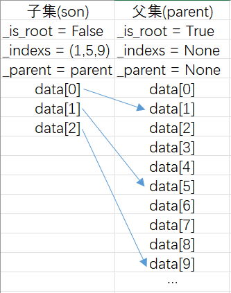

# 项目文档

## 项目结构

- `module` `__init__.py`
- `module` `main.py`
- `file` `README.md`
- `file` `documents.md`
- `directory` `autosave`
    - 自动保存的训练状态
- `directory` `dataset`
    - 原始数据集
    - `file` `IMDB Dataset.csv`
- `directory` `lstm`
    - 与神经网络有关的文件

    - `directory` `model`
        - 训练好的神经网络模型
- `package` [`src`](#package-src)
    - 源代码
    - `module` `__init__.py`
    - `module` `tfidf_svm.py`
    - `module` `tfidf_lstm.py`
    - `module` `word2vec_lstm.py`
        - `package` [`utils`](#package-src.utils)
            - 底层API
            - `module` `__init__.py`
            - `module` [`convert.py`](#convertpy)
                - `enum` [`UniqueWords`](#enum-UniqueWords)
                - `class` [`Converter`](#class-Converter)
                - `class` [`Word2VecSequence`](#class-Word2VecSequence)
            - `module` [`dataset.py`](#datasetpy)
                - `class` [`_SplittableDataset`](#class-_SplittableDataset)
                - `class` [`IMDBDataset`](#class-IMDBDataset)
                - `class` [`TfIdfDataset`](#class-TfIdfDataset)
                - `class` [`Word2VecDataset`](#class-Word2VecDataset)
            - `module` [`lstm.py`](#lstmpy)
                - `class` [`TextClassifier`](#class-TextClassifier)
                - `class` [`SelfAttention`](#class-SelfAttention)
            - `module` [`models.py`](#modelspy)
                - `class` [`GridResult`](#class-GridResult)
                - `class` [`SVMTrainingState`](#class-SVMTrainingState)
                - `class` [`NNTrainingState`](#class-NNTrainingState)
            - `module` [`svm.py`](#svmpy)
                - `enum` [`SymType`](#enum-SymType)
                - `enum` [`KernelType`](#enum-KernelType)
                - `class` [`SVM`](#class-SVM)
            - `module` `tensor.py`
            - `module` [`train.py`](#trainpy)
                - `class` [`Trainer`](#class-Trainer)
            - `module` `typecheck.py`
- `directory` `svm`
    - `directory` `model`
    - `directory` `data`

---

# package src

# package src.utils

## convert.py

[源代码](src/utils/convert.py)

### enum UniqueWords

[`UniqueWords`](#enum-UniqueWords)是`str`类型的枚举，提供了词汇表中填充词和未知词的索引。

|   类型    |     值      |
| :-------: | :---------: |
| `PADDING` | `<PADDING>` |
| `UNKNOWN` | `<UNKNOWN>` |

### class Converter

[`Converter`](#class-Converter)是[`IMDBDataset`](#class-IMDBDataset)和[`Trainer`](#class-Trainer)之间的桥梁，它提供了一些易于使用的API，可以将数据集中的原始数据转换为`SVM`或`Neutral Network`便于处理的数据形式，从而简化了数据处理的流程。

> Tips:[`tfidf_matrix`](#Converter-tfidf-matrix)、[`feature_names`](#Converter-feature-names)、[`tfidf_dataset`](#Converter-tfidf-dataset)属性无需显式调用[`tfidf()`](#method-tfidf())方法，内部会自动调用。即使你改变了[`dataset`](#Converter-dataset)属性，这些属性也会自动更新。

#### Attributes

|        属性         |                             类型                             |            初始值             |                             描述                             |
| :-----------------: | :----------------------------------------------------------: | :---------------------------: | :----------------------------------------------------------: |
|      `logger`       | [`logging.Logger`](https://docs.python.org/zh-cn/3.10/library/logging.html?highlight=logging%20logger#logging.Logger) | `logging.getLogger(__name__)` |                          日志记录器                          |
|      `dataset`      |    [`src.utils.dataset.IMDBDataset`](#class-IMDBDataset)     |          `Required`           |                        要转换的数据集                        |
|     `processes`     |                            `int`                             |              `1`              | 多进程处理的进程数<br/>取值范围为[`0`, [`os.cpu_count()`](https://docs.python.org/zh-cn/3.10/library/os.html?highlight=os%20cpu_count#os.cpu_count)] |
|   `tfidf_matrix`    | [`scipy.sparse.csr_matrix`](https://docs.scipy.org/doc/scipy/reference/generated/scipy.sparse.csr_matrix.html) |               /               |               `self.dataset`的`tfidf`稀疏矩阵                |
|   `feature_names`   | [`numpy.ndarray`](https://numpy.org/doc/stable/reference/generated/numpy.ndarray.html) |               /               |                   `self.dataset`的特征单词                   |
| `reviews_generator` |                 `Generator[str, None, None]`                 |               /               |              `self.dataset`中的`review`的生成器              |
|    `reviews_cut`    |                `tuple[tuple[str, ...], ...]`                 |               /               |                    `review`的NLTK分词结果                    |
| `labels_generator`  |                `Generator[float, None, None]`                |               /               |              `self.dataset`中的`label`的生成器               |
|   `tfidf_dataset`   |   [`src.utils.dataset.TfIdfDataset`](#class-TfIdfDataset)    |               /               |        包含了`self.dataset`的`tfidf`和`label`的数据集        |
| `word2vec_dataset`  | [`src.utils.dataset.Word2VecDataset`](#class-Word2VecDataset) |               /               |        包含了`self.dataset`的词向量和`label`的数据集         |

#### method \_\_init__()

初始化一个[`Converter`](#class-Converter)实例。

##### 输入

|    参数     |                             类型                             |                            初始值                            |         描述         |
| :---------: | :----------------------------------------------------------: | :----------------------------------------------------------: | :------------------: |
|  `dataset`  | [`torch.utils.data.Dataset`](https://pytorch.org/docs/stable/data.html?highlight=dataset#torch.utils.data.Dataset) |                          `Required`                          |    要转换的数据集    |
| `processes` |                            `int`                             | [`os.cpu_count()`](https://docs.python.org/zh-cn/3.10/library/os.html?highlight=os%20cpu_count#os.cpu_count) | `to_svm`方法的进程数 |

##### 输出

`None`

#### method tfidf()

使用[` sklearn.feature_extraction.text.TfidfVectorizer`](https://scikit-learn.org/stable/modules/generated/sklearn.feature_extraction.text.TfidfVectorizer.html)计算数据集的TF-IDF表示，并更新`self.tfidf_matrix`、`self.feature_names`、`self.tfidf_dataset`属性。

##### 输入

|   参数   |       类型       | 初始值 |                             描述                             |
| :------: | :--------------: | :----: | :----------------------------------------------------------: |
| `kwargs` | `dict[str, Any]` | `None` | 关键字参数，用于初始化[`TfidfVectorizer`](https://scikit-learn.org/stable/modules/generated/sklearn.feature_extraction.text.TfidfVectorizer.html)，可选参数请查阅其文档 |

##### 输出

`self.tfidf_dataset`

#### method word2vec()

首先加载`nltk`的`punkt`分词器，使用[`nltk.word_tokenize`](https://www.nltk.org/api/nltk.tokenize.word_tokenize.html?highlight=word_tokenize#nltk.tokenize.word_tokenize)对原始数据集中的句子进行分词，
然后使用[`gensim.models.word2vec.Word2Vec`](https://radimrehurek.com/gensim/models/word2vec.html#gensim.models.word2vec.Word2Vec)计算分词的词向量并转换成张量([`torch.Tensor`](https://pytorch.org/docs/stable/tensors.html#torch.Tensor))，
并调用`src.utils.tensor.random_tensors_outside_existed_tensors`函数生成两个距离所有有效词向量足够远的张量(此处的距离指欧几里得距离)，分别作为填充张量和未知单词(不在单词表里的单词)的张量并存入单词表，最后创建并返回`self.word2vec_dataset。`

> **Warning**: 一般情况下不应该指定`sentences`的值。如果你改变了`sentences`的值，将会基于指定的句子计算的词向量，而不是预期的`self.dataset`中的句子。

> Notes: 你可以指定`workers`的值，其默认值是`self.processes`。

##### 输入

|   参数   |       类型       | 初始值 |                             描述                             |
| :------: | :--------------: | :----: | :----------------------------------------------------------: |
| `kwargs` | `dict[str, Any]` | `None` | 关键字参数，用于初始化[`Word2Vec`](https://radimrehurek.com/gensim/models/word2vec.html#gensim.models.word2vec.Word2Vec)<br/>`sentences`和`workers`有如上所述的默认值，其它可选参数请查阅其文档 |

##### 输出

`self.word2vec_dataset`

#### method tfidf_to_svm()

将`self.dataset`中的原始数据转换成`tfidf`矩阵（如果没有转换过的话），并将`tfidf`矩阵存储为标准`libsvm`格式，返回该文件的绝对路径。

##### 输入

|    参数     | 类型  | 初始值 |                             描述                             |
| :---------: | :---: | :----: | :----------------------------------------------------------: |
| `save_path` | `str` | `None` | 保存路径，默认保存在`'.\svm\data`文件夹，实际保存路径见方法返回值 |

##### 输出

SVM训练文件的绝对路径。

#### method word2vec_to_svm()

**NOT IMPLEMENTED**

**WON'T FIX**

> **Warning**: 在某次`git commit`中，我大幅修改了`word2vec()`方法的实现，导致原有的`word2vec_to_svm()`方法与现有的词向量存储方式不兼容。
> 由于时间原因，使用词向量训练支持向量机的实验部分已被删除，因此该方法将不会适配现有的词向量存储方式。
>
> 目前，调用本方法将会抛出`NotImplementedError`。

将`self.dataset`中的原始数据转换成词向量（如果没有转换过的话），并将词向量存储为标准`libsvm`格式，返回该文件的绝对路径。

##### 输入

|    参数     | 类型  | 初始值 |                             描述                             |
| :---------: | :---: | :----: | :----------------------------------------------------------: |
| `save_path` | `str` | `None` | 保存路径，默认保存在`'.\svm\data`文件夹，实际保存路径见方法返回值 |

##### 输出

SVM训练文件的绝对路径。

### class Word2VecSequence

> Note: 类`Word2VecSequence`仅供内部使用，用户无需创建其实例。

[`Word2VecSequence`](#class-Word2VecSequence)是[`collection.abc.Sequence`](https://docs.python.org/zh-cn/3.10/library/collections.abc.html#collections.abc.Sequence)的子类，其元素为一个词向量(准确的来说，是一个二维张量，形状为`(最大句子长度, 词张量维数)`)。

由于各个句子长短不一，将它们同时转换成相同长度的二维张量并存储，将会占用大量内存。以`IMDB Dataset`为例，当词向量维数取默认值`100`时，最终的所有以张量形式表示的句子理论上将会占用`46GB`的内存，如果直接运行程序而不加以改进，将会导致电脑严重卡顿，甚至蓝屏死机，这显然是不可接受的。

因此，在存储这些张量时，我借鉴了生成器(`Generator`)的思想，以时间换空间。在类的内部，实际上存储的是单词表、所有句子的分词结果、计算句子张量的算法。每次获取元素时，根据单词表和句子的分词计算对应的句子张量。在程序运行时，经粗略估算，其实际内存占用仅约`1GB`，相较于之前`46GB`的理论占用，节省内存的效果显著。

#### Attributes

该类无公共属性。

#### method \_\_init__()

初始化一个[`Word2VecSequence`](#class-Word2VecSequence)实例。

##### 输入

|      参数       |           类型            |   初始值   |                             描述                             |
| :-------------: | :-----------------------: | :--------: | :----------------------------------------------------------: |
|  `word_tensor`  |  `Mapping[str, Tensor]`   | `Required` | 单词表，一个从字符串到张量的映射(`Mapping`)，其中应该包括[`UniqueWords`](#enum-UniqueWords)中的元素 |
| `cut_sentences` | `Sequence[Sequence[str]]` | `Required` |              分词结果，形状是`(句子数, 分词数)`              |

##### 输出

`None`

#### method \_\_len__()

获得该实例的长度

##### 输入

`None`

##### 输出

总句子数量。

#### method \_\_getitem__()

通过索引获取一个或多个句子的张量表示，已填充至相同长度。

##### 输入

|  参数  |     类型      |   初始值   |                   描述                   |
| :----: | :-----------: | :--------: | :--------------------------------------: |
| `item` | `int | slice` | `Required` | 要获取张量的句子的索引，可以是整数或切片 |

##### 输出

当输入为一个整数时，返回一个二维张量，形状为`(最大句子长度, 词张量维度)`。

当输入为一个切片时，返回一个三维张量，形状为`(切片长度, 最大句子长度, 词张量维度)`。

---

## dataset.py

[源代码](src/utils/dataset.py)

### class _SplittableDataset

[`_SplittableDataset`](#class-_SplittableDataset)继承了[`torch.utils.data.Dataset`](https://pytorch.org/docs/stable/data.html?highlight=dataset#torch.utils.data.Dataset), `Sized`, `abc.ABC`，有一个抽象方法`get_subset()`。

它是`src.utils.dataset`的核心部分，是[`IMDBDataset`](#class-IMDBDataset), [`TfIdfDataset`](#class-TfIdfDataset), [`Word2VecDataset`](#class-Word2VecDataset)的父类。用户**不应该**创建该类的实例。

它提供了根据索引创建子集、按比例划分子集的功能。其特点是子集的数据以映射的方式直接从父集获取，不需要复制原数据至子集内保存，大幅减少了数据集存储时的内存占用。

举个例子：如图所示，`son`和`parent`都是[`_SplittableDataset`](#class-_SplittableDataset)的一个实例。

其中，`son._indexs = (1, 5, 9) son._parent = parent`，那么`son[0] = son._parent[son._indexs[0]] = parent[1]`。



> **Warning**: 由于子类存储的数据结构不明，内部映射方法**不支持**切片(`slice`)。子类实现`__getitem__()`方法时，如果有通过切片一次获取多条数据的需求，可多次调用`__getitem__()`方法或重载映射方法。

> Notes: 子集中可能没有父集中的某些属性，此时应调用[`_mapping_attr()`](#method-_mapping_attr())方法获取父集中的对应属性。如:
>
> ```python
> class ExampleDataset(_SplittableDataset):
> 	def __init__(self, data):
> 		super.__init__()
> 		self.data = data
> 
> 
> >>> parent = ExampleDataset([1, 1, 4, 5, 1, 4])
> >>> son = parent.split(0.5)[0]
> >>> son.data[0]
> AttributeError: 'ExampleDataset' object has no attribute 'data'
> >>> son._mapping_attr("data")[0]
> 1
> ```
>
> 上述代码仅用于示例，实际上不应该让用户使用该保护(`protected`)方法获取根集中的属性，你应该用`property`装饰器提供一个获取根集的属性的接口(`Getter`)。如：
>
> ```python
> class ExampleDataset(_SplittableDataset):
> 	def __init__(self, data):
> 		super.__init__()
> 		self._data = data
> 
> 	@property
>     def data(self):
>         return self._mapping_attr("_data")
> ```
>
> 这段代码仍有一定缺陷：当用户在子集调用`instance.data`时，将直接访问到根集的`data`属性，你应该根据数据集内存储的数据结构改进`data`方法。

#### Attributes

|    属性    |                       类型                        | 初始值 |                             描述                             |
| :--------: | :-----------------------------------------------: | :----: | :----------------------------------------------------------: |
| `_is_root` |                      `bool`                       | `True` |                          是否为根集                          |
| `_indexs`  |                   `tuple[int]`                    | `None` | `self._is_root`为`True`时，`None`<br/>`self._is_root`为`False`时，子集对应的父集的索引 |
| `_parent`  | [`_SplittableDataset`](#class-_SplittableDataset) | `None` | `self._is_root`为`True`时，`None`<br/>`self._is_root`为`False`时，子集对应的父集 |

#### method \_\_init__()

初始化一个[`_SplittableDataset`](#class-_SplittableDataset)实例。

创建一个根集时，使用默认值即可。创建一个子集时，将对应的参数值传给此函数。

##### 输入

|   参数    |                       类型                        | 初始值 |                             描述                             |
| :-------: | :-----------------------------------------------: | :----: | :----------------------------------------------------------: |
| `is_root` |                      `bool`                       | `True` |                          是否为根集                          |
| `indexs`  |                   `tuple[int]`                    | `None` | `self._is_root`为`True`时，`None`<br/>`self._is_root`为`False`时，子集对应的父集的索引 |
| `parent`  | [`_SplittableDataset`](#class-_SplittableDataset) | `None` | `self._is_root`为`True`时，`None`<br/>`self._is_root`为`False`时，子集对应的父集 |

##### 输出

`None`

#### method _mapping_index()

一个递归函数。给定一个有效索引值，返回映射至根集的索引。

##### 输入

|  参数   | 类型  |   初始值   |          描述          |
| :-----: | :---: | :--------: | :--------------------: |
| `index` | `int` | `Required` | 有效索引值，不支持切片 |

##### 输出

在根集中的实际索引。

#### method _mapping_attr()

一个递归函数。给定一个属性，返回映射至根集的属性。

##### 输入

|  参数  | 类型  |   初始值   |         描述         |
| :----: | :---: | :--------: | :------------------: |
| `attr` | `str` | `Required` | 要获取的根集中的属性 |

##### 输出

在根集中的对应属性。

#### method _get()

获取指定属性的某个元素。

> Notes: `_get()`方法适合在`__getitem__()`方法中使用，而`_mapping_attr()`方法适合在一个属性接口(`Getter`)中使用。

##### 输入

|  参数   | 类型  |   初始值   |          描述          |
| :-----: | :---: | :--------: | :--------------------: |
| `attr`  | `str` | `Required` |  要获取的根集中的属性  |
| `index` | `int` | `Required` | 有效索引值，不支持切片 |

##### 输出

在根集中的对应属性的对应元素。

#### method _create_and_init_subset_with_data()

创建一个子集，一般用于辅助实现抽象方法`get_subset()`。

##### 输入

> Notes: `__Gettable`指的是具有`__getitem__()`方法的对象。

> Notes: `**data`曾用于将父集的数据复制到子集中，可能会占用过多的内存。现在由于映射机制的加入，已弃用。`**data`的键是要为子集创建的属性的属性名，值是一个元组，元组的第一项是一个可调用对象，它接受一个生成器，并将生成器内的元素转换成属性的值，元组的第二项是父集的某一个属性。
>
> ```python
> class ExampleDataset(_SplittableDataset):
> 	def __init__(self, data):
> 		super.__init__()
> 		self._data = data
> 
> 
> >>> parent = ExampleDataset([1, 1, 4, 5, 1, 4])
> # 创建一个子集，子集的_data属性是一个列表
> >>> son = parent._create_and_init_subset_with_data(1, 3, 5, _data=(list, parent.data))
> >>> son._data[1]
> 5
> >>> type(son._data)
> <class 'list'>
> # 创建一个子集，子集的_data属性是一个张量
> >>> import torch
> >>> tensor_son = parent._create_and_init_subset_with_data(
> 	1, 3, 5,
> 	_data=(lambda x: torch.Tensor(list(x)), parent.data)
> )
> >>> son._data[1]
> tensor(5.)
> ```

|   参数   |                          类型                          | 初始值 |              描述              |
| :------: | :----------------------------------------------------: | :----: | :----------------------------: |
| `*index` |                         `int`                          | `None` | 用于指定子集的索引值`_indexs`  |
| `**data` | `tuple[Callable[[Generator], __Gettable], __Gettable]` | `None` | 为新创建的子集指定某个属性的值 |

##### 输出

新创建的子集。

#### abstractmethod get_subset()

获取一个子集，由参数中的索引指定。

> Notes: 可以使用`_create_and_init_subset_with_data()`方法创建一个部分初始化的对象，再指定某些自定义属性的值。
>
> ```python
> class ExampleDataset(_SplittableDataset):
> 	def __init__(self, filename):
> 		super.__init__()
> 		self._filename = filename
> 		self._data = self._read(self._filename) # 从数据集文件中读取数据
> 
> 
> 	def get_subset(self, *index):
> 		subset = self._create_and_init_subset_with_data(*index)
> 		subset._filename = self._filename
> ```
>
> 你也许会问：为什么不直接使用`__init__()`方法新建一个数据集呢？例如`subset = ExampleDataset(sub_filename)`。
>
> 原因很简单：
>
> - 从资源的角度来看，当数据集文件特别大时，即使是创建一个较小的子数据集文件也会消耗大量资源。
> - 从效率的角度来看，创建一个子集本质上没有改变数据读取的方式，不论你直接将数据存进内存，还是需要时从磁盘读取，读取数据的效率与父集一样，但你创建一个子数据集文件却会浪费大量时间。
>
> 与之相反，通过映射机制直接获取父集的数据，不仅不用创建新文件，在数据索引的效率上也没有明显降低。
>
> - 如果你的数据直接存在内存里，只需要获取数据在根集中的映射，再索引，除非当前数据集是父集的子集的子集的...(这显然是你的问题，你搞那么多子集干啥？)
> - 如果你的数据在需要时从磁盘读取，和磁盘的性能相比，获取数据在根集中的映射的消耗可以忽略不计。

##### 输入

|   参数   | 类型  | 初始值 |             描述              |
| :------: | :---: | :----: | :---------------------------: |
| `*index` | `int` | `None` | 用于指定子集的索引值`_indexs` |

##### 输出

新创建的子集。

#### method split()

将父集根据比例按顺序或随机分为两个子集。

##### 输入

> Notes: `shuffle = True`时并不会真的改变父集数据的顺序。

|   参数    |  类型   |   初始值   |                   描述                   |
| :-------: | :-----: | :--------: | :--------------------------------------: |
|  `ratio`  | `float` | `Required` | 两个子数据集数据长度之比，在`(0, 1)`之间 |
| `shuffle` | `bool`  |  `False`   |      分割时是否打乱父集中数据的顺序      |

##### 输出

长度为`2`的元组`tuple[son1, son2]`，其中`len(son1) / len(son2) = ratio`。

### class IMDBDataset

[`IMDBDataset`](#class-IMDBDataset)继承了[`src.utils.dataset._SplittableDataset`](#class-_SplittableDataset)，它从`csv`文件中读取数据集，转化为特定的数据结构，便于开展后续的数据处理工作。

> Notes: `self[i]`等价于`self.items[i]`, `len(self)`等价于`len(self.items)`。

#### Attributes

|        属性        |            类型            |   初始值   |             描述              |
| :----------------: | :------------------------: | :--------: | :---------------------------: |
| `dataset_pathname` |           `str`            | `Required` | `csv`文件的路径，**必须**存在 |
|      `items`       | `tuple[tuple[str, float]]` |     /      |       数据集中的所有项        |

#### method \_\_init__()

初始化一个[`IMDBDataset`](#class-IMDBDataset)实例。

##### 输入

|        参数        | 类型  |   初始值   |           描述           |
| :----------------: | :---: | :--------: | :----------------------: |
| `dataset_pathname` | `str` | `Required` | 数据集路径，**必须**存在 |

##### 输出

`None`

### class TfIdfDataset

[`TfIdfDataset`](#class-TfIdfDataset)继承了[`src.utils.dataset._SplittableDataset`](#class-_SplittableDataset)，用于TF-IDF有关的训练。

一般由[`Converter`](#class-Converter)根据计算结果自动创建，用户**不需要**自行创建该类的实例。

#### Attributes

|   属性   |                             类型                             |   初始值   |   描述   |
| :------: | :----------------------------------------------------------: | :--------: | :------: |
| `values` | [`scipy.sparse.csr_matrix`](https://docs.scipy.org/doc/scipy/reference/generated/scipy.sparse.csr_matrix.html) | `Required` | TF-IDF值 |
| `labels` | [`torch.Tensor`](https://pytorch.org/docs/stable/tensors.html#torch.Tensor) | `Required` | 情感标签 |

#### method \_\_init__()

初始化一个[`TfIdfDataset`](#class-TfIdfDataset)实例。

##### 输入

|   参数   |                             类型                             |   初始值   |   描述   |
| :------: | :----------------------------------------------------------: | :--------: | :------: |
| `values` | [`scipy.sparse.csr_matrix`](https://docs.scipy.org/doc/scipy/reference/generated/scipy.sparse.csr_matrix.html) | `Required` | TF-IDF值 |
| `labels` | [`torch.Tensor`](https://pytorch.org/docs/stable/tensors.html#torch.Tensor) | `Required` | 情感标签 |

##### 输出

`None`

### class Word2VecDataset

[`Word2VecDataset`](#class-Word2VecDataset)继承了[`src.utils.dataset._SplittableDataset`](#class-_SplittableDataset)，用于词向量有关的训练。

#### Attributes

|   属性   |                             类型                             |   初始值   |    描述    |
| :------: | :----------------------------------------------------------: | :--------: | :--------: |
| `values` |                   `Sequence[torch.Tensor]`                   | `Required` | 词向量序列 |
| `labels` | [`torch.Tensor`](https://pytorch.org/docs/stable/tensors.html#torch.Tensor) | `Required` |  情感标签  |

#### method \_\_init__()

初始化一个[`Word2VecDataset`](#class-Word2VecDataset)实例。

##### 输入

|   参数   |                             类型                             |   初始值   |    描述    |
| :------: | :----------------------------------------------------------: | :--------: | :--------: |
| `values` |                   `Sequence[torch.Tensor]`                   | `Required` | 词向量序列 |
| `labels` | [`torch.Tensor`](https://pytorch.org/docs/stable/tensors.html#torch.Tensor) | `Required` |  情感标签  |

##### 输出

`None`

---

## lstm.py

[源代码](src/utils/lstm.py)

### class TextClassifier

[`TextClassifier`](#class-TextClassifier)继承了[`torch.nn.Module`](https://pytorch.org/docs/stable/generated/torch.nn.Module.html?highlight=torch+nn+module#torch.nn.Module)，是一个`LSTM`模型，用于神经网络训练。

#### Attributes

|     属性      |                             类型                             |                            初始值                            |    描述     |
| :-----------: | :----------------------------------------------------------: | :----------------------------------------------------------: | :---------: |
| `input_size`  |                            `int`                             |                          `Required`                          |  输入维数   |
| `hidden_size` |                            `int`                             |                          `Required`                          | 隐藏层维数  |
| `output_size` |                            `int`                             |                          `Required`                          |  输出维数   |
| `num_layers`  |                            `int`                             |                          `Required`                          |  LSTM层数   |
|    `lstm`     | [`torch.nn.LSTM`](https://pytorch.org/docs/stable/generated/torch.nn.LSTM.html?highlight=torch+nn+lstm#torch.nn.LSTM) | [`torch.nn.LSTM(input_size=input_size, hidden_size=hidden_size, num_layers=num_layers, dropout=dropout, batch_first=True)`](https://pytorch.org/docs/stable/generated/torch.nn.LSTM.html?highlight=torch+nn+lstm#torch.nn.LSTM) |  LSTM模型   |
|     `fc`      | [`torch.nn.Module`](https://pytorch.org/docs/stable/generated/torch.nn.Module.html?highlight=torch+nn+module#torch.nn.Module) | [`torch.nn.Linear(hidden_size, output_size)`](https://pytorch.org/docs/stable/generated/torch.nn.Linear.html?highlight=torch+nn+linear#torch.nn.Linear) |  全连接层   |
|   `sigmoid`   | [`torch.nn.Sigmoid`](https://pytorch.org/docs/stable/generated/torch.nn.Sigmoid.html?highlight=torch+nn+sigmoid#torch.nn.Sigmoid) | [`torch.nn.Sigmoid()`](https://pytorch.org/docs/stable/generated/torch.nn.Sigmoid.html?highlight=torch+nn+sigmoid#torch.nn.Sigmoid) | `Sigmoid`层 |

#### method \_\_init__()

初始化一个[`TextClassifier`](#class-TextClassifier)实例

##### 输入

|     属性      |                             类型                             |   初始值   |                             描述                             |
| :-----------: | :----------------------------------------------------------: | :--------: | :----------------------------------------------------------: |
| `input_size`  |                            `int`                             | `Required` |                           输入维数                           |
| `hidden_size` |                            `int`                             | `Required` |                          隐藏层维数                          |
| `num_layers`  |                            `int`                             | `Required` |                           LSTM层数                           |
| `output_size` |                            `int`                             | `Required` |                           输出维数                           |
|     `fc`      | [`torch.nn.Module`](https://pytorch.org/docs/stable/generated/torch.nn.Module.html?highlight=torch+nn+module#torch.nn.Module) |   `None`   |                           全连接层                           |
|   `dropout`   |                           `float`                            |    `0`     | `dropout`层要丢弃的神经元的比例<br/>`dropout∈[0,1]`，等于`0`时禁用`dropout` |

##### 输出

`None`

#### method init_hidden()

初始化隐藏层和细胞层状态，将其设置为零张量。

> Notes: 此函数在前向传播时自动调用，用户**不需要**显式调用此方法。

##### 输入

|      属性      |                             类型                             |   初始值   |                  描述                  |
| :------------: | :----------------------------------------------------------: | :--------: | :------------------------------------: |
| `input_tensor` | [`torch.Tensor`](https://pytorch.org/docs/stable/tensors.html#torch.Tensor) | `Required` | 根据输入张量来初始化隐藏层和细胞层状态 |

##### 输出

`None`

#### method detach_hidden()

当某一训练轮次结束，反向传播结束，隐藏层和细胞层的计算图被Pytorch自动删除。进入下一轮训练，再次反向传播时，Pytorch找不到隐藏层和细胞层的计算图，导致训练失败。调用此方法则可以将隐藏层和细胞层张量从计算图中分离出去，避免此错误发生。

> RuntimeError: Trying to backward through the graph a second time (or directly access saved tensors after they have already been freed). Saved intermediate values of the graph are freed when you call .backward() or autograd.grad(). Specify retain_graph=True if you need to backward through the graph a second time or if you need to access saved tensors after calling backward.

##### 输入

`None`

##### 输出

`None`

#### method forward()

前向传播函数。

> Notes: Pytorch内部自动调用，用户**不需要**显式调用此方法。

##### 输入

|      属性      |                             类型                             |   初始值   |    描述    |
| :------------: | :----------------------------------------------------------: | :--------: | :--------: |
| `input_tensor` | [`torch.Tensor`](https://pytorch.org/docs/stable/tensors.html#torch.Tensor) | `Required` | 模型的输入 |

##### 输出

前向传播的结果。

### class SelfAttention

[`SelfAttention`](#class-SelfAttention)继承了[`torch.nn.Module`](https://pytorch.org/docs/stable/generated/torch.nn.Module.html?highlight=torch+nn+module#torch.nn.Module)，实现了自注意力机制，用于神经网络训练。

以下是自注意力机制`Self-Attention`的公式：

$$
\text{Attention}(Q, K, V) = \text{softmax}\left(\frac{QK^T}{\sqrt{d_k}}\right)V
$$

其中，$Q$、$K$、$V$ 分别表示查询`Query`、键`Key`和值`Value`的向量表示，$d_k$ 是嵌入维度。通过计算查询和键的内积得到注意力权重，然后对值进行加权求和以得到最终的输出。这个注意力权重表示了查询和键之间的相似度，即指示了哪些键对于查询更加重要。

#### method \_\_init__()

初始化一个[`SelfAttention`](#class-SelfAttention)实例

##### 输入

|     属性      | 类型  |   初始值   |   描述   |
| :-----------: | :---: | :--------: | :------: |
| `hidden_size` | `int` | `Required` | 嵌入维度 |

##### 输出

`None`

#### method forward()

前向传播函数。

> Notes: Pytorch内部自动调用，用户**不需要**显式调用此方法。

##### 输入

|      属性      |                             类型                             |   初始值   |    描述    |
| :------------: | :----------------------------------------------------------: | :--------: | :--------: |
| `input_tensor` | [`torch.Tensor`](https://pytorch.org/docs/stable/tensors.html#torch.Tensor) | `Required` | 模型的输入 |

##### 输出

前向传播的结果。

---

## models.py

[源代码](src/utils/models.py)

> **Warning**: 本模块使用的是[**Pydantic1.10**](https://docs.pydantic.dev/1.10/)，与目前的最新版本[Pydantic2.3](https://docs.pydantic.dev/2.3/)**不兼容**，如果你按照[README.md](README.md)中的指令安装项目依赖，则不需要担心版本兼容问题，如果你自行安装了所有依赖，请确保你安装的Pydantic版本**小于**2.0，否则代码将不能运行。

### class GridResult

[`GridResult`](#class-GridResult)继承了[`pydantic.BaseModel`](https://docs.pydantic.dev/1.10/usage/models/)，描述了网格搜索的结果

#### Attributes

|    属性    |  类型   |   初始值   |    描述    |
| :--------: | :-----: | :--------: | :--------: |
|    `c`     | `float` | `Required` |  惩罚系数  |
|    `g`     | `float` | `Required` | 核函数参数 |
| `accuracy` | `float` | `Required` |   准确率   |

### class SVMTrainingState

[`SVMTrainingState`](#class-SVMTrainingState)继承了[`pydantic.BaseModel`](https://docs.pydantic.dev/1.10/usage/models/)，描述了支持向量机的训练状态

#### Attributes

|      属性       |               类型                |  初始值   |     描述     |
| :-------------: | :-------------------------------: | :-------: | :----------: |
| `current_range` | `tuple[tuple[float, float], ...]` | `tuple()` | 当前训练范围 |
|    `results`    |        `tuple[GridResult]`        |   `[]`    | 网格搜索结果 |

### class NNTrainingState

[`NNTrainingState`](#class-NNTrainingState)继承了[`pydantic.BaseModel`](https://docs.pydantic.dev/1.10/usage/models/)，描述了神经网络的训练状态

#### Attributes

|           属性           |   类型   | 初始值  |   描述   |
|:----------------------:|:------:|:----:|:------:|
|    `current_epoch`     | `int`  | `0`  | 当前训练轮次 |
|     `total_epoch`      | `int`  | `0`  | 总训练轮次  |
|   `model_state_dict`   | `dict` | `{}` |  模型参数  |
| `optimizer_state_dict` | `dict` | `{}` | 优化器参数  |


---

## svm.py

[源代码](src/utils/svm.py)

### enum SymType

[`SymType`](#class-SymType)是`int`类型的枚举，提供了5种SVM类型

|       类型        |  值  |
|:---------------:|:---:|
|     `C_SVC`     | `0` |
|    `NU_SVC`     | `1` |
| `ONE_CLASS_SVM` | `2` |
|  `EPSILON_SVR`  | `3` |
|    `NU_SVR`     | `4` |

### enum KernelType

[`KernelType`](#class-KernelType)是`int`类型的枚举，提供了5种核函数类型

|           类型            |  值  |
|:-----------------------:|:---:|
|        `LINEAR`         | `0` |
|      `POLYNOMIAL`       | `1` |
| `RADIAL_BASIS_FUNCTION` | `2` |
|        `SIGMOID`        | `3` |
|  `PRECOMPUTED_KERNEL`   | `4` |
### class SVM

[`SVM`](#class-SVM)提供了对SVM模型的封装，可以进行训练、预测、保存和加载等操作

#### Attributes

|       属性       |                                                                   类型                                                                   |  初始值   |    描述     |
|:--------------:|:--------------------------------------------------------------------------------------------------------------------------------------:|:------:|:---------:|
|    `model`     | [`libsvm.svmutil.svm_model`](https://github.com/cjlin1/libsvm/blob/aed66346593ec0e075f38eda10fef0c1fb132692/python/libsvm/svm.py#L352) | `None` |   SVM模型   |
| `grid_results` |                                             [`list[models.GridResult]`](#class-GridResult)                                             | `None` | 网格搜索的结果列表 |


#### method \_\_init__()

初始化一个`SVM`实例

##### 输入

`None`

##### 输出

`None`

#### method load()

加载一个SVM模型，`model`和`model_path`至少有一个不为`None`，若两者都不为`None`，则`model`优先

##### 输入

|      参数      |                                                                   类型                                                                   |  初始值   |  描述   |
|:------------:|:--------------------------------------------------------------------------------------------------------------------------------------:|:------:|:-----:|
|   `model`    | [`libsvm.svmutil.svm_model`](https://github.com/cjlin1/libsvm/blob/aed66346593ec0e075f38eda10fef0c1fb132692/python/libsvm/svm.py#L352) | `None` | SVM模型 |
| `model_path` |                                                                 `str`                                                                  | `None` | 模型路径  |

##### 输出

这个实例自身，即`self`

#### method save()

保存一个SVM模型

##### 输入

|   参数   |  类型   |    初始值     |   描述   |
|:------:|:-----:|:----------:|:------:|
| `path` | `str` | `Required` | 模型保存路径 |

##### 输出

保存路径的绝对路径

#### <a name="svm-train">method train()</a>

训练一个SVM模型

##### 输入

|           参数            |                类型                 |    初始值     |                                        描述                                         |
|:-----------------------:|:---------------------------------:|:----------:|:---------------------------------------------------------------------------------:|
|     `problem_path`      |               `str`               | `Required` |                                  标准libsvm格式训练集路径                                  |
|       `sym_type`        |    [`SymType`](#class-SymType)    |   `None`   |                            set type of SVM (default 0)                            |
|      `kernel_type`      | [`KernelType`](#class-KernelType) |   `None`   |                      set type of kernel function (default 2)                      |
|        `degree`         |               `int`               |   `None`   |                       degree in kernel function (default 3)                       |
|         `gamma`         |              `float`              |   `None`   |                 gamma in kernel function (default 1/num_features)                 |
|         `coef0`         |              `float`              |   `None`   |                       coef0 in kernel function (default 0)                        |
|         `cost`          |              `float`              |   `None`   |                cost in C-SVC, epsilon-SVR, and nu-SVR (default 1)                 |
|          `nu`           |              `float`              |   `None`   |               nu in nu-SVC, one-class SVM, and nu-SVR (default 0.5)               |
|        `epsilon`        |              `float`              |   `None`   |             the epsilon in loss function of epsilon-SVR (default 0.1)             |
|      `cache_size`       |              `float`              |   `None`   |                     set cache memory size in MB (default 100)                     |
|       `tolerance`       |              `float`              |   `None`   |              set tolerance of termination criterion (default 0.001)               |
|       `shrinking`       |               `int`               |   `None`   |            whether to use the shrinking heuristics, 0 or 1 (default 1)            |
| `probability_estimates` |               `int`               |   `None`   | whether to train a SVC or SVR model for probability estimates, 0 or 1 (default 0) |
|        `weight`         |              `float`              |   `None`   |           the parameter C of class i to weight*C, for C-SVC (default 1)           |
|        `n_fold`         |               `int`               |   `None`   |                           n-fold cross validation mode                            |

##### 输出

训练结果，当`n_fold`不为`None`时，返回交叉验证的结果，否则返回训练的模型

#### method predict()

预测一个SVM模型。

当`self.model is None`时，`model`和`model_path`至少有一个不为`None`，若两者都不为`None`，则`model`优先。
当`self.model is not None`时，忽略`model`和`model_path`参数。

##### 输入

|           参数            |                                                                   类型                                                                   |    初始值     |                                        描述                                         |
|:-----------------------:|:--------------------------------------------------------------------------------------------------------------------------------------:|:----------:|:---------------------------------------------------------------------------------:|
|     `problem_path`      |                                                                 `str`                                                                  | `Required` |                                  标准libsvm格式测试集路径                                  |
|         `model`         | [`libsvm.svmutil.svm_model`](https://github.com/cjlin1/libsvm/blob/aed66346593ec0e075f38eda10fef0c1fb132692/python/libsvm/svm.py#L352) |   `None`   |                                      训练好的模型                                       |
|      `model_path`       |                                                                 `str`                                                                  |   `None`   |                                     训练好的模型的路径                                     |
| `probability_estimates` |                                                                 `int`                                                                  |   `None`   | whether to train a SVC or SVR model for probability estimates, 0 or 1 (default 0) |

##### 输出

- `tuple[list, tuple[float, float, float], list]`
  - `list` p_labels: A list of predicted labels
  - `tuple[float, float, float]` p_acc
    - `float` accuracy (for classification)
    - `float` mean-squared error
    - `float` squared correlation coefficient (for regression)
  - `list` p_vals: A list of decision values or probability estimates (if `probability_estimates == 1`). If `k` is the number of classes, for decision values, each element includes results of predicting `k(k-1)/2` binary-class SVMs. For probabilities, each element contains `k` values indicating the probability that the testing instance is in each class. Note that the order of classes here is the same as 'model.label' field in the model structure.

#### method grid()

网格搜索，寻找最优参数。

因为筛选过程耗时很久，所以增加了程序终止时自动保存功能（使用[`Trainer`](#class-Trainer)），并且可以从中断处继续筛选。

如果要从中断处恢复筛选，应设置`from_record = True`，`record_path = {your_file_path}`，`your_file_path`为自动保存的训练状态文件，保持训练参数和原来的训练参数一致。（具体来说，训练参数是指`problem_path`、`c_min`、`c_max`、`c_step`、`g_min`、`g_max`、`g_step`）
此处的`problem_path`与原来一致是指该路径指定的训练集文件内容不变。

> 后续版本将会改进自动保存机制，恢复筛选将不需要输入训练参数，而是从保存文件中自动读取。

##### 输入

|        参数        |   类型    |                初始值                |                                           描述                                            |
|:----------------:|:-------:|:---------------------------------:|:---------------------------------------------------------------------------------------:|
|  `problem_path`  |  `str`  |              `None`               |                                     标准libsvm格式训练集路径                                     |
|     `n_fold`     |  `int`  |                `5`                |                                         交叉验证折数                                          |
| `enable_logging` | `bool`  |              `False`              |                                        是否打印搜索进度                                         |
|     `c_min`      | `float` |              `1e-8`               |                                        Cost的最小值                                         |
|     `c_max`      | `float` |               `1e8`               |                                        Cost的最大值                                         |
|     `c_step`     | `float` |               `10`                |                                         Cost的步长                                         |
|     `g_min`      | `float` |              `1e-8`               |                                        gamma的最小值                                        |
|     `g_max`      | `float` |               `1e8`               |                                        gamma的最大值                                        |
|     `g_step`     | `float` |               `10`                |                                        gamma的步长                                         |
|    `detailed`    | `bool`  |              `False`              | 是否返回详细信息<br/>`detailed = True`时，返回所有搜索结果的列表，并绘制结果图像<br/>`detailed = False`时，只返回准确度最高的结果 |
|    `img_name`    |  `str`  | `r'..\svm\train\grid_result.png'` |                                         保存的图片名                                          |
|      `dpi`       |  `int`  |              `1000`               |                                         图片的dpi                                          |
|  `from_record`   | `bool`  |              `False`              |                                       是否从记录文件中读取                                        |
|  `record_path`   |  `str`  |              `None`               |                                         记录文件路径                                          |

##### 输出

`detailed = True`时，返回所有搜索结果的列表，并绘制结果图像
`detailed = False`时，只返回准确度最高的结果


---

## train.py

[源代码](src/utils/train.py)

### class Trainer

[`Trainer`](#class-Trainer)封装了一些用于训练SVM和神经网络的API。它提供了程序终止时自动保存训练结果等有用的功能。

#### Attributes

|         属性         |                                                              类型                                                               |          初始值          |                                                   描述                                                    |
|:------------------:|:-----------------------------------------------------------------------------------------------------------------------------:|:---------------------:|:-------------------------------------------------------------------------------------------------------:|
|     `autosave`     |                                                            `bool`                                                             |        `True`         |                                               是否自动保存训练结果                                                |
|   `autosave_dir`   |                                                             `str`                                                             |   `r'..\autosave'`    |                                             自动保存的**文件夹**路径                                              |
|  `tfidf_dataset`   |      [`torch.utils.data.Dataset`](https://pytorch.org/docs/stable/data.html?highlight=dataset#torch.utils.data.Dataset)       |        `None`         | 存有`tfidf`和`label`的数据集，一般使用[`Converter`](#class-Converter)的[`tfidf_dataset`](#Converter-tfidf-dataset)属性 |
| `word2vec_dataset` |      [`torch.utils.data.Dataset`](https://pytorch.org/docs/stable/data.html?highlight=dataset#torch.utils.data.Dataset)       |        `None`         |                                                **TODO**                                                 |
|  `svm_train_path`  |                                                             `str`                                                             |        `None`         |                                          SVM的训练集文件，**必须**实际存在                                           |
|  `svm_model_path`  |                                                             `str`                                                             |        `None`         |                                           SVM的模型文件，**必须**实际存在                                           |
|       `svm`        |                                                    [`svm.SVM`](#class-SVM)                                                    | [`SVM()`](#class-SVM) |                               svm实例，训练SVM时使用该属性的[`train()`](#svm-train)方法                               |
|      `model`       | [`torch.nn.Module`](https://pytorch.org/docs/stable/generated/torch.nn.Module.html?highlight=torch+nn+module#torch.nn.Module) |        `None`         |                   要训练的神经网络模型，一般使用[`lstm.LSTMModel`](#class-LSTMModel)，也可以传入其它`Module`                   |
|    `optimizer`     |        [`torch.optim.Optimizer`](https://pytorch.org/docs/stable/optim.html?highlight=optimizer#torch.optim.Optimizer)        |        `None`         |                                              训练神经网络时使用的优化器                                              |
|    `criterion`     | [`torch.nn.Module`](https://pytorch.org/docs/stable/generated/torch.nn.Module.html?highlight=torch+nn+module#torch.nn.Module) |        `None`         |                                             训练神经网络时使用的损失函数                                              |
|      `device`      |            [`torch.device`](https://pytorch.org/docs/stable/tensor_attributes.html?highlight=device#torch.device)             |        `None`         |                                              训练神经网络时使用的设备                                               |

#### method \_\_init\_\_()

初始化[`Trainer`](#class-Trainer)实例

##### 输入

|         参数         |                                                              类型                                                               |       初始值        |                                                   描述                                                    |
|:------------------:|:-----------------------------------------------------------------------------------------------------------------------------:|:----------------:|:-------------------------------------------------------------------------------------------------------:|
|     `autosave`     |                                                            `bool`                                                             |      `True`      |                                               是否自动保存训练结果                                                |
|   `autosave_dir`   |                                                             `str`                                                             | `r'..\autosave'` |                                             自动保存的**文件夹**路径                                              |
|  `tfidf_dataset`   |      [`torch.utils.data.Dataset`](https://pytorch.org/docs/stable/data.html?highlight=dataset#torch.utils.data.Dataset)       |      `None`      | 存有`tfidf`和`label`的数据集，一般使用[`Converter`](#class-Converter)的[`tfidf_dataset`](#Converter-tfidf-dataset)属性 |
| `word2vec_dataset` |      [`torch.utils.data.Dataset`](https://pytorch.org/docs/stable/data.html?highlight=dataset#torch.utils.data.Dataset)       |      `None`      |                                                **TODO**                                                 |
|  `svm_train_path`  |                                                             `str`                                                             |      `None`      |                                          SVM的训练集文件，**必须**实际存在                                           |
|  `svm_model_path`  |                                                             `str`                                                             |      `None`      |                                           SVM的模型文件，**必须**实际存在                                           |
|      `model`       | [`torch.nn.Module`](https://pytorch.org/docs/stable/generated/torch.nn.Module.html?highlight=torch+nn+module#torch.nn.Module) |      `None`      |                   要训练的神经网络模型，一般使用[`lstm.LSTMModel`](#class-LSTMModel)，也可以传入其它`Module`                   |
|    `optimizer`     |        [`torch.optim.Optimizer`](https://pytorch.org/docs/stable/optim.html?highlight=optimizer#torch.optim.Optimizer)        |      `None`      |                                              训练神经网络时使用的优化器                                              |
|    `criterion`     | [`torch.nn.Module`](https://pytorch.org/docs/stable/generated/torch.nn.Module.html?highlight=torch+nn+module#torch.nn.Module) |      `None`      |                                             训练神经网络时使用的损失函数                                              |
|      `device`      |            [`torch.device`](https://pytorch.org/docs/stable/tensor_attributes.html?highlight=device#torch.device)             |      `None`      |                                              训练神经网络时使用的设备                                               |

##### 输出

`None`

#### method train()

训练神经网络

因为训练过程耗时很久，所以增加了程序终止时自动保存功能，并且可以从中断处继续训练。

如果要从中断处恢复训练，应设置`from_record = True`，`record_path = {your_file_path}`，`your_file_path`为自动保存的训练状态文件，保持训练参数和原来的训练参数一致。（具体来说，训练参数是指`train_loader`、`num_epochs`）
此处的`train_loader`与原来一致是指该`DataLoader`存储的训练集内容不变。

> 后续版本将会改进自动保存机制，恢复训练将不需要输入训练参数，而是从保存文件中自动读取。

##### 输入

|       参数        |  类型  | 初始值  |                             描述                             |
| :---------------: | :----: | :-----: | :----------------------------------------------------------: |
|     `epochs`      | `int`  |   `1`   |                          训练的轮数                          |
|    `svm_mode`     | `bool` | `False` |   **关键字参数**，以`self.tfidf_dataset`作为训练集进行训练   |
|  `word2vec_mode`  | `bool` | `False` | **关键字参数**，以`self.word2vec_dataset`作为训练集进行训练  |
| `enable_logging`  | `bool` | `False` |               **关键字参数**，是否打印训练进度               |
|   `from_record`   | `bool` | `False` |         **关键字参数**，是否从记录文件中读取训练结果         |
|   `record_path`   | `str`  | `None`  |                 **关键字参数**，记录文件路径                 |
| `**loader_kwargs` | `dict` | `None`  | 见[`torch.utils.data.DataLoader`](https://pytorch.org/docs/stable/data.html?highlight=dataloader#torch.utils.data.DataLoader)，不能传入`dataset`参数 |

##### 输出

这个实例自身，即`self`

#### method evaluate()

评估神经网络

##### 输入

|      参数       |                                                             类型                                                              |    初始值     |         描述         |
|:-------------:|:---------------------------------------------------------------------------------------------------------------------------:|:----------:|:------------------:|
| `test_loader` | [`torch.utils.data.DataLoader`](https://pytorch.org/docs/stable/data.html?highlight=dataloader#torch.utils.data.DataLoader) | `Required` | 存放测试集的`DataLoader` |

##### 输出

模型预测准确度

#### method predict()

使用神经网络预测

##### 输入

|   参数    |                                              类型                                              |    初始值     |    描述    |
|:-------:|:--------------------------------------------------------------------------------------------:|:----------:|:--------:|
| `texts` | [`torch.Tensor`](https://pytorch.org/docs/stable/tensors.html?highlight=tensor#torch.Tensor) | `Required` | 要预测的文本张量 |

##### 输出

预测结果，类型为[`torch.Tensor`](https://pytorch.org/docs/stable/tensors.html?highlight=tensor#torch.Tensor)

#### method save()

保存训练结果

##### 输入

|     参数      |  类型   |             初始值             |    描述     |
|:-----------:|:-----:|:---------------------------:|:---------:|
| `save_path` | `str` | `r'..\lstm\model\lstm.pth'` | 神经网络的保存路径 |

##### 输出

保存路径的绝对路径

#### method load()

加载神经网络

##### 输入

|     参数      |  类型   |             初始值             |     描述      |
|:-----------:|:-----:|:---------------------------:|:-----------:|
| `load_path` | `str` | `r'..\lstm\model\lstm.pth'` | 要加载的神经网络的路径 |

##### 输出

这个实例自身，即`self`